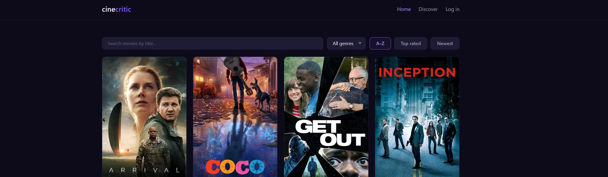

# CineCritic — Movie Review Website


A full-stack movie review site where users browse films, submit star ratings and reviews, and discover new movies through community ratings, genre recommendations, and a TMDb-backed search.

## Tech Stack

| Layer | Technology |
|---|---|
| Frontend | Vanilla HTML, CSS, JavaScript (no framework) |
| Backend | Node.js + Express |
| Database | SQLite via better-sqlite3 |
| Auth | express-session + bcrypt |
| External | TMDb API (optional, Advanced tier) |

## Setup

```bash
# 1. Clone the repo
git clone <repo-url>
cd <repo-dir>

# 2. Install dependencies
npm install

# 3. Configure environment
cp .env.example .env
# Edit .env and set SESSION_SECRET to a long random string.
# Optionally add TMDB_API_KEY (get a free key at https://www.themoviedb.org/settings/api).

# 4. Seed the database with sample movies
node seed.js

# 5. Start the server
npm start

# 6. Open in browser
open http://localhost:3000
```

## Features

### Basic
- Browsable movie grid with poster, title, year, genre, and average star rating
- Movie detail modal with synopsis, community reviews list, and average rating breakdown
- Star rating input (1–5 stars) with keyboard and hover support
- Review text with XSS-safe rendering

### Enhanced
- User registration and login (session-based, bcrypt-hashed passwords)
- Reviews are tied to authenticated user accounts
- Sort movies by title, average rating, or release year
- Filter movies by genre
- Upvote individual reviews
- User profile page showing all submitted reviews
- Friendly error toasts for API failures; empty states throughout

### Advanced
- **Discover page** (`/search.html`) — search The Movie Database by title, see results with poster + overview, and import any movie into the local catalog with one click
- **"You might also like"** recommendations in the movie modal — finds genre-overlapping movies ranked by community rating, personalized per user (excludes movies already reviewed)

## Running tests

```bash
# Start the server first (in a separate terminal)
npm start

# Run API tests
npm run test:api
```

All 30 API tests cover auth flows, movie listing, filtering, sorting, review submission, likes, recommendations, and TMDb route behavior.

## Project structure

```
├── server/
│   ├── index.js          # Express entry point
│   ├── db.js             # SQLite schema + connection
│   ├── middleware/
│   │   └── auth.js       # requireAuth middleware
│   └── routes/
│       ├── auth.js       # register / login / logout / me
│       ├── movies.js     # list, detail, submit review, recommend
│       ├── reviews.js    # like
│       └── tmdb.js       # search + import (requires TMDB_API_KEY)
├── public/
│   ├── index.html        # Home — movie grid
│   ├── login.html        # Login / register
│   ├── profile.html      # User profile
│   ├── search.html       # TMDb discover page
│   ├── css/style.css
│   └── js/
│       ├── api.js         # Fetch wrapper (all /api/* calls live here)
│       ├── nav.js         # Shared nav bar
│       ├── movies.js      # Home grid + search/filter
│       ├── movie-detail.js# Modal + review form + recommendations
│       ├── auth.js        # Login / register forms
│       ├── profile.js     # Profile page
│       ├── tmdb-search.js # Discover page
│       ├── toast.js       # Toast notification system
│       └── ui.js          # Shared helpers (stars, avatar, date, etc.)
├── data/moviereviews.db  # SQLite file (gitignored)
├── seed.js               # Populates 13 sample movies
├── test-api.js           # End-to-end API tests
├── .env.example          # Environment variable template
└── API.md                # Full API route documentation
```

## Screenshots

   
